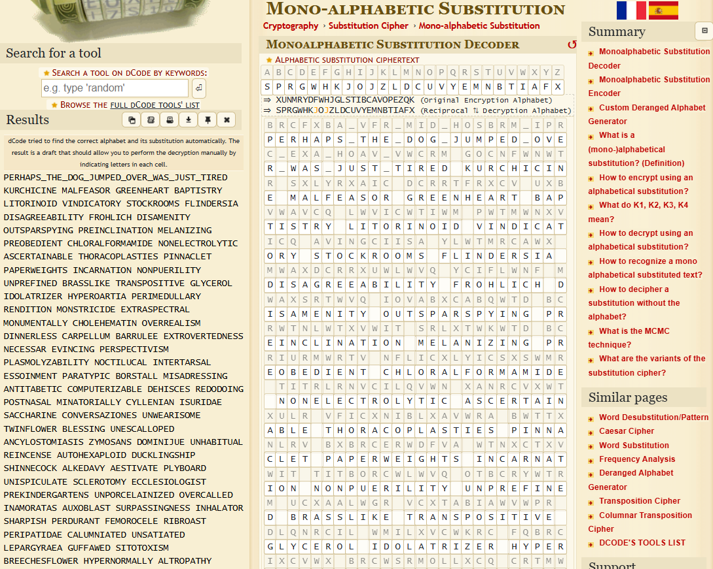

# spelling-quiz

## Challenge
I found the flag, but my brother wrote a program to encrypt all his text files. He has a spelling quiz study guide too, but I don't know if that helps.

## Solution

```python
import random
import os

files = [
    os.path.join(path, file)
    for path, dirs, files in os.walk('.')
    for file in files
    if file.split('.')[-1] == 'txt'
]
```
This code block basically stores all the files ending with `.txt` in the files list.

```python
alphabet = list('abcdefghijklmnopqrstuvwxyz')
random.shuffle(shuffled := alphabet[:])
dictionary = dict(zip(alphabet, shuffled))
```
This code block basically creates a dictionary corresponding to each alphabet in order and its corresponding shuffled alphabets.
Thus, this is a classic example of a monoalphabetic substitution cipher which can be solved using frequency analysis.

Upon feeding some 100 entries from the [study-guide.txt](/public/study-guide.txt), into a [monoalphabetic substitution cipher decoder tool](https://www.dcode.fr/monoalphabetic-substitution), the flag is found.



## Flag
`picoCTF{PERHAPS_THE_DOG_JUMPED_OVER_WAS_JUST_TIRED}`